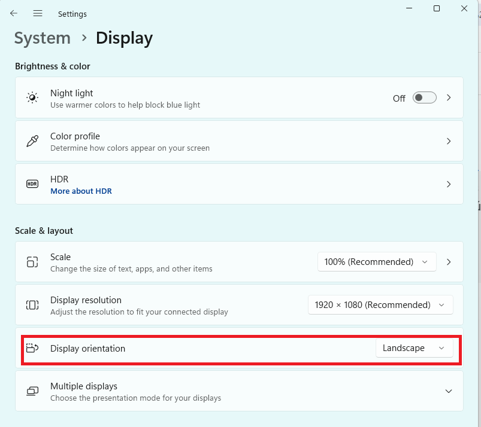
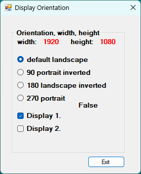
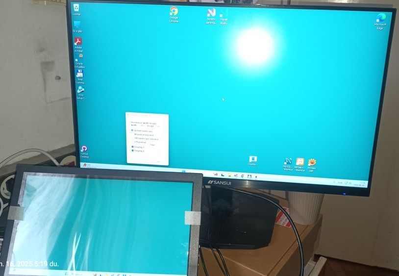
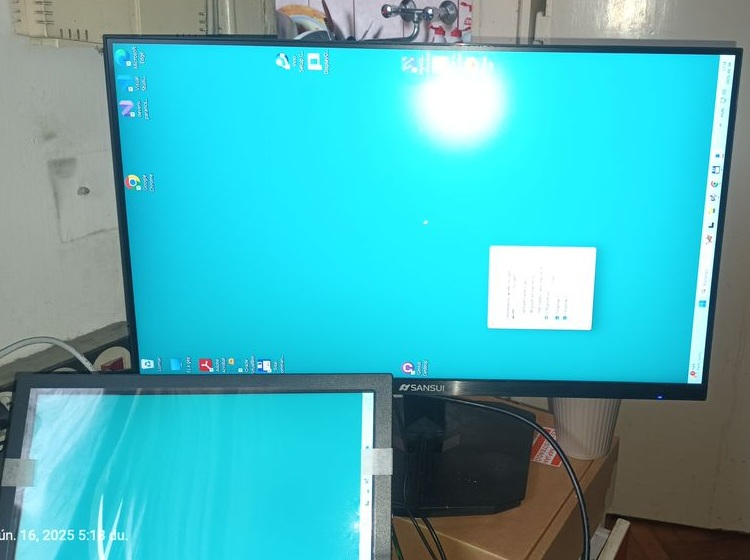
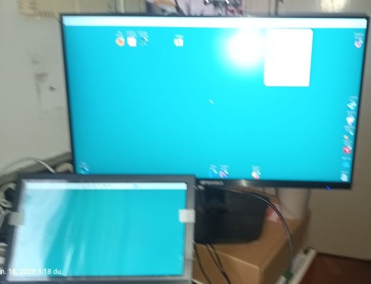
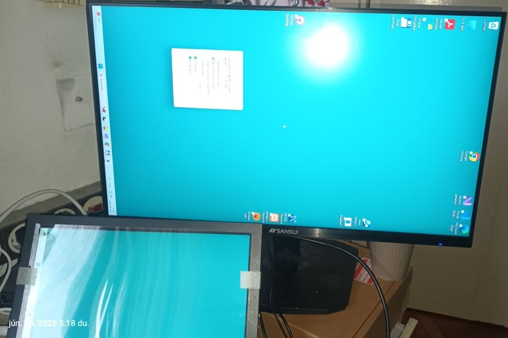

## Windows Display Orientation Desktop Application

Windows .NET Framework 4.8

Instantly flip screen orientation horizontal / vertical with a  GUI command.  
Because switching between landscape and portrait mode using Display settings on windows takes too many clicks. 
Works with multiple monitors and all display orientation modes (landscape, landscape inverted, portrait, portrait inverted). 

Preview oroginal Windows 11 Desktop -> System -> Display 
 

Image of application: 
 

### needs 4 arguments :

RotateDisplay.cs:
Running(uint deviceID_a, uint rotateMode_a, ref int width_a, ref int height_a) { ... };
- argument 1 : deviceID_a (0: first main screen, 1: second screen, 2: third etc.)
- argument 2 : rotateMode_a rotation (0: default landscape, 90: portrait inverted, 180: landscape inverted, 270: portrait) 
- argument 3 : get Width width_a
- argument 4 : get Height height_a

### hotkeys :

Press :
ESC key : exit 
F2 key : back to default landscape 

### install binary :

.\DisplayOrientation\install\Output\DisplayOrientation 1.0.1.0.exe 

### .NET Framework 4.8 redistributable :

[Download .NET Framework 4.8](https://dotnet.microsoft.com/en-us/download/dotnet-framework/net48) 

### notes :

- doesn't need to be run as admin
- rotation can only be set to 4 available values (0, 90, 180, 270), any other value won't work. 
- can't set screen xy position in relation to other screens as possible with Display settings menu.

### photos :

 0 degrees 
  

 90 degrees 
  

 180 degrees 
  

 270 degrees 
  

